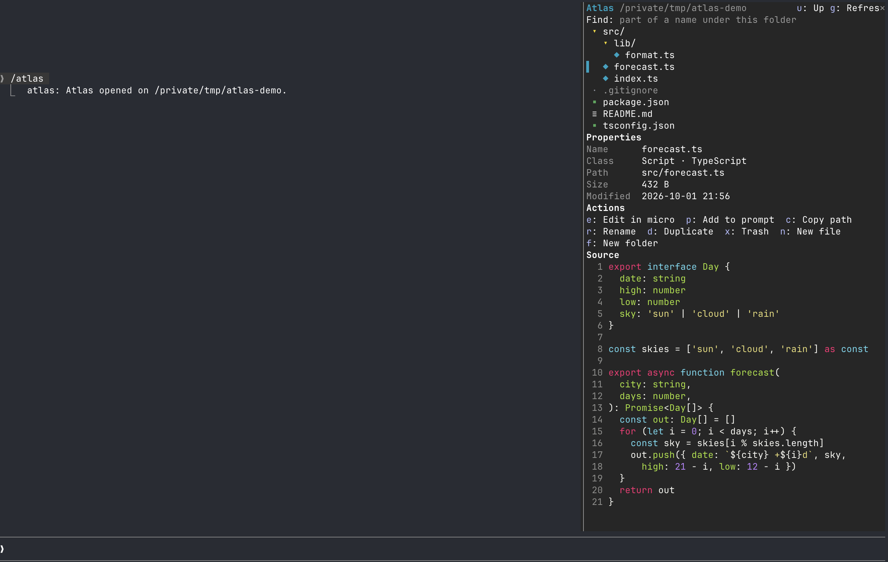

# atlas

A file explorer in a pane beside Claude Code. Browse a tree explorer, find properties, and modify without leaving Claude Code.




## Install

Add the marketplace:

```
/plugin marketplace add jamubc/toolbox
```

Install the plugin:

```
/plugin install atlas@toolbox
```

## Usage

| Command | function |
| --- | --- |
| `/atlas` | Opens the explorer where you left it last time in this project, or on the folder Claude Code started in. |
| `/atlas <folder>` | Opens the explorer there. |
| `/atlas <file>` | Shows the file in the tree and opens it in micro. |
| The trail | The path at the top is a trail of folders: click one to go back up to it. |
| Click a folder | Opens or closes it. |
| Click a file | Shows its Properties and Source: code with line numbers, Markdown rendered, a PNG as a picture in kitty and Ghostty. |
| Git marks | Files git sees as changed, added, untracked, deleted or renamed carry `M`, `A`, `?`, `D`, `R` in color; a folder holding one carries `•`. The header counts them. |
| Find | Type part of a name and press Enter; **text** searches inside files instead (ripgrep, else grep) and a hit opens the file at that line. |
| Key | Action |
| `e` | Edit in [micro](https://micro-editor.github.io) |
| `p` | Add the file to your prompt as `@path` |
| `c` | Copy the path |
| `a` | Open with the system's own app (`open`, `xdg-open`) |
| `r` / `d` | Rename / duplicate |
| `x` | Move to the Trash, after you confirm |
| `n` / `f` | New file / new folder, in the selected folder |
| `o` | Open the selected folder as the root |
| `u` / `g` | Go up a folder / refresh |
| `h` / `z` | Show or hide dotfiles (kept between sessions) / collapse every folder |

While the pane shows, the folders on screen and git are read again every few seconds, so what Claude writes appears by itself. The root and the open folders are remembered per project.

### In the editor

micro runs for real inside the pane: your own micro settings, colors and plugins.

- **Click the text to type.** Claude Code only hands keys to the editor after a click, and **Esc** gives them back to the prompt.
- **Ctrl+S** saves, **Ctrl+Q** quits back to the explorer, and most other keys reach micro.
- Claude Code keeps **Ctrl+C**, **Ctrl+Z** and **Ctrl+O** for itself, and **Esc** returns the keys, so the header has **Esc**, **Copy** and **Undo** buttons that send them to micro. Don't press Ctrl+Z: it suspends Claude Code.
- Pasting with your terminal goes to the Claude prompt. Use micro's **Ctrl+V**, which reads the clipboard.
- The pane won't close while micro is open: quit with Ctrl+Q so micro can ask about unsaved changes.
- `/config` → Editor runs another terminal editor instead: `nano` and `vim` work too.

## Compatibility

| Where | Explorer | Editor |
| --- | --- | --- |
| Claude Code in any terminal | Yes | Yes |
| Claude desktop app, VS Code extension | Yes | No. |
| Mobile | Yes, without Find or naming fields | No |

| System | Status |
| --- | --- |
| macOS | Tested: browsing, Find, rename, new, duplicate, Trash, editing in micro. |
| Linux | Should work; untested. Trash needs `gio` or `trash-cli`; opening with an app needs `xdg-open`. |
| Windows | Not supported. Editing says so, and paths assume `/`. |

- **Needs** Python 3.9 or later (macOS's own `/usr/bin/python3` works) and micro, or the editor you set. If one is missing, the pane says which and how to fix it.
- Wide characters (CJK, emoji) show as `?` in the editor; the file itself is untouched.

<details>
<summary>Safety</summary>

<br>

- **Trash, never delete.** It uses macOS's `trash`, or `gio trash` or `trash-put` on Linux, after a confirmation. If none exists, nothing is deleted.
- **No overwrites.** Rename, new file, new folder and duplicate refuse a name that already exists, and names cannot contain `/` or be `..`.
- **Unsaved edits.** If Claude Code exits or is killed, or atlas reloads, while micro is open, micro closes and keeps a backup. Reopen the file and micro offers to recover it.
- **/clear and /compact.** The pane, the tree and an open editor carry on through both: `/clear` starts a new session in the same process, so atlas keeps what it was showing and writes it into the new one.

</details>

<details>
<summary>Functions</summary>

<br>

- `hooks/register.tsx` draws the pane, answers `/atlas`, and runs the actions.
- `hooks/files.ts` holds the path, file class, tree, git status and search-output helpers.
- `editor/term.py` runs the editor in a pseudo-terminal, keeps its screen with a small terminal emulator, and streams it to the pane. Keys and clicks come back over a Unix socket in a private temp folder.
- `hooks/terminal.tsx` lies over the editor's picture and passes on keys, clicks and drags.

</details>

<details>
<summary>Privacy</summary>

- Nothing reaches Claude unless you press **Add to prompt**, or open a path with `/atlas`, whose reply names the folder.
- Everything runs locally: no network. `git status` and the search run only under the folder shown.

</details>
