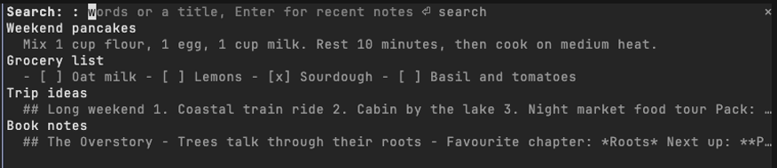

# instantnotes

Your [InstantNotes](https://github.com/Jam-Sw/InstantNotes) library, directly in Claude Code. Search, read and capture notes without leaving the terminal.



***Every note you have, one command away.***

## Install

Add the marketplace:

```
/plugin marketplace add jamubc/toolbox
```

Install the plugin:

```
/plugin install instantnotes@toolbox
```

## Usage

| Command | What it does |
| --- | --- |
| `/notes` | Opens a pane with your recent notes. |
| `/notes <words>` | Opens the pane searching for those words or a title. |
| `/note <text>` | Saves the text as a new note. |
| `b` / `u` in a note | Back to the results / put the note in your prompt. |
| `/config` → InstantNotes binary | Use an `instantnotes` that is not on your PATH. |

<details>
<summary>Setup details</summary>

<br>

- Needs InstantNotes 0.9.0 or later, with `instantnotes` on your PATH.
- With no **Library database** set in `/config`, it uses the app's own library: `~/.local/share/com.instantnotes.app` on Linux, `~/Library/Application Support/com.instantnotes.app` on macOS.

</details>

<details>
<summary>Functions</summary>

<br>

- `hooks/register.tsx` draws the pane and answers `/notes` and `/note`.
- Each action runs `instantnotes mcp` once and asks it one question, so the plugin follows the same rules as any agent.

</details>

<details>
<summary>Privacy</summary>

- Notes reach Claude only when you put one in your prompt.
- It writes only when you run `/note`.
- It talks only to the local `instantnotes` program, never the network.

</details>
