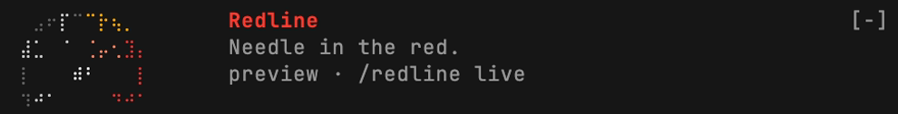

# redline

Too many Claudes going at once? Feeling overwhelemed? redline puts a guage into claude so you can plan your time better.



***stop starting new Claudes and finish the ones already running.***

## Install

Add the marketplace:

```
/plugin marketplace add jamubc/toolbox
```

Install the plugin:

```
/plugin install redline@toolbox
```

## Usage

| Command | What it does |
| --- | --- |
| UI Mod | gauge & labels. |
| `/redline` | Toggles detailed view. |
| `/redline <0-25>` | demo: enable. |
| `/redline live` | demo: disable |
| `/config` → Show the count at the bottom of the terminal | toggle labels |
| `/config` → Show the fuel gauges | toggle the 5H / 7D / CTX dials |

## Fuel gauges

<details>
<summary>The three dials, off until switched on</summary>

<br>

With **Show the fuel gauges** on, three more dials ride along: beside the tachometer above your prompt, and under it in the pane.

| Dial | What it reads |
| --- | --- |
| 5H | Your plan's five-hour rate-limit window. |
| 7D | Your plan's seven-day rate-limit window. |
| CTX | This session's context, filling as the conversation grows. |

Each needle travels from F (full) to E (empty) as its tank is used, and the last stretch before E is the red reserve. The plan dials need a subscription; CTX works for everyone. A dial the engine has no reading for stays dim.

</details>

## Stages

<details>
<summary>Stages by sessions working</summary>

<br>

| Working | Stage |
| --- | --- |
| 0 | Napping |
| 1–2 | Idling |
| 3–5 | Cruising |
| 6–8 | Busy |
| 9–12 | Very Busy |
| 13–17 | Under Pressure |
| 18–20 | Redline |
| 21–24 | Overboost |
| 25+ | Blown |

</details>

<details>
<summary>Functions</summary>

<br>

- Every two seconds it reads `ps` and `lsof`.
- A session is a `claude` process attached to a terminal.
- A session counts as working while Claude Code holds a `caffeinate` child process, which happens on macOS during a turn. On Linux every session reads as idle.
- With the fuel gauges on, it reads `$.session.usage()` at the start of a session and again on every `session.measure`: after each turn, and when a rate-limit window moves a whole point.

</details>

<details>
<summary>Privacy</summary>

- Read-only: it never starts or stops anything.
- It reads process information from `ps` and `lsof`, and with the fuel gauges on, the session usage figures the status line already has.

</details>
